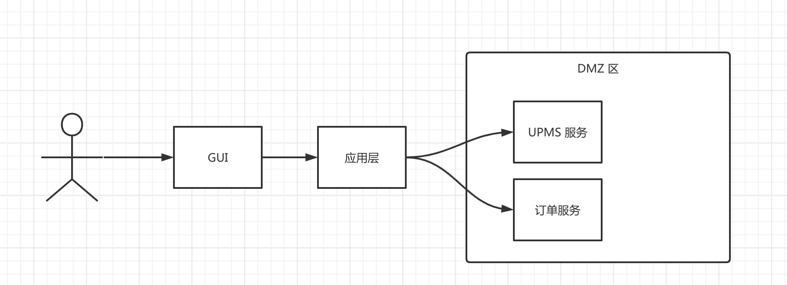

# eleven

#### 介绍

micro service learning project

#### 代码结构

- eleven-application 应用层，提供有状态的应用逻辑
    - eleven-app-demo 一个示例应用，运行于用户接入网络，对接 GUI 界面，提供定制化应用逻辑！
    - eleven-app-upms 用户权限管理的应用层，可运行，可作为微服务发布
    - eleven-app-upms-client 用户权限管理的应用层客户端，可以作为其他应用层远程微服务调用
- eleven-component 公共组件层，提供工具包，基础库。
    - eleven-core 核心包，提供：工具库，通用场景类，通用异常类，通用枚举类，通用工具类
    - eleven-core-feign 远程客户端调用核心支持
    - eleven-core-rest Web层 Restful Api 层支持
    - eleven-core-domain 公共领域服务层支持
- eleven-domain 领域服务层，提供无状态领域服务
    - eleven-domain-upms-core 用户权限管理的共享内核
    - eleven-domain-upms-service 用户权限管理领域的服务层
- eleven-deploy 部署脚本
    - /src/main/docker/jvm jvm 环境镜像封装，提供链路追踪，日志采集层基础组件
    - /src/main/docker/ElasticSearch es 镜像封装，提供使用的分词插件等支持
    - /src/main/docker/mysql mysql 镜像封装
    - /src/main/docker/rabbitmq rabbitmq 镜像封装
    - ...

#### 编码约定

1. xxxHelper 为特定业务场景下的工具类，提供静态方法,比如：PageableQueryHelper 将系统的分页模型->
   技术手段分页模型，AuthenticationHelper
2. xxxUtil 为特定技术场景下的工具类，提供静态方法,比如：NetworkUtil#ping(ip)
3. xxxConvertor 为业务领域下的转换类，只可以单向转换 domain->Dto(DataTransferObject),domain->Vo(ViewObject)
4. domain+Service 位领域对象的服务层，提供最核心的领域服务，只直接处理领域下的使用场（Action 命令），和领域事件发布

#### 请求链路



#### 技术选型

- 注册中心 & 配置中心 使用 nacos 做配置中心和注册中心处理
- 服务通信 服务之间通讯使用 spring cloud - openFeign 框架，数据序列化使用 jackson 。
- 网关 网关使用 spring cloud - gateway
- 负载均衡 docker swarm 自带负载均衡
- 链路追踪 spring cloud - sleuth 处理请求链路，采集服务器使用 zipkin 框架，GUI 显示使用 jaeger(可考虑将 skywalking 封装到
  docker 里面替代)
- 日志检测 直接 tcp 写入到 logstash
- mq rabbitmq + 自研消息系统协调器
- 缓存 本地缓存使用caffeine 分布式缓存使用 redis 缓存（redisson 做数据网格客户端）

#### 接口设计

状态码采用 http 标准状态码，统一处理器为 `RestApiAdvice`，按照约定：4XX 表示客户端错误，5xx 表示服务器端错误，2xx 表示正确响应，3xx
表示重定向；

参考 ：

- https://rapidapi.com/blog/put-vs-patch/
- https://google.aip.dev/134#patch-and-put

##### 4xx 状态码

- 资源不存在 404 NOT_FOUND ，在必须的父级数据不存在，或者是地址不存在的时候响应
- 权限不足 - 403 FORBIDDEN ，在指定操作没有权限的时候
- 校验失败 - 422 UNPROCESSABLE_ENTITY 在提交的数据校验失败，或者业务前提条件不足的时候
- 服务器错误 - 500 INTERNAL_SERVER_ERROR 在服务器端出现错误，应该由程序员来解决的时候

##### 2xx 使用

200 暂定只使用 200 一个状态，既：只要服务器能正确处理请求，并且处理正确，则相应 200
状态码。有一个歧义是，比如登入的时候用户名错误这种响应，其实并不不存在任何处理错误，而是正确处理的结果，所以首先状态码应该响应
200，然后在相应内容中应该包含登入失败的原因/编码。

比如：
```
POST /auth/credentials/verify {username,password}

========> response <=========
status 200

{pass:false,message:"your login id is not found!"}

```
诸如此类，在特定场景下的处理结果被拒绝，需要给出拒绝理由的场景，服务器应该响应 200，并且在结果中描述清楚结果代码以及原因。

##### rest api 设计

- 创建 POST /XXX 响应为 200 OK 表示资源被创建,成功的时候相应创建的资源，拒绝的时候响应失败原因，带有 4xx 状态
- 读取 GET /XXX 响应为 200 OK 表示资源被读取到，成功的时候响应此资源，拒绝的时候响应失败原因，带有 4xx 状态
- 更新 PUT /XXX 响应为 200 OK 表示全量修改一个资源，比如根据用户 ID 修改用户全部信息,此类操作接口幂等，成功的时候不响应任何结果，拒绝的时候响应失败原因，带有 4xx 状态
- 修改 PATCH /XXX 响应为 200 OK 表示局部更新一个资源，比如修单独修改用户名，或者是将一个网站文档进行发布（PATCH
  /art/{16}/publish）此接口可返回资源处理结果，比如文章发布的流水记录；拒绝的时候响应失败原因，带有 4xx 状态
- DELETE /XXX 响应为 200 OK 表示资源被删除，成功的时候不响应任何结果，拒绝的时候响应失败原因，带有 4xx 状态
