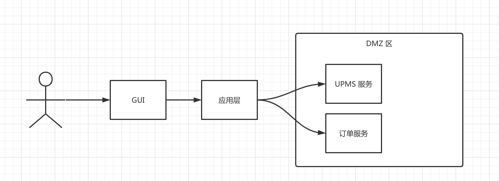

# eleven

## todo
- [ ] 凤凰架构例子
- [ ] DDD demo
- [ ] IDDD demo

## DDD 高度总结

### 限界上下文
> 哲学告诉我们，处理事情要抓住主要矛盾，并且不要越权出圈，其中的主要矛盾就是你的上下文，不要出的那个圈，就是限定的界。
> 简单得说：就是合理的业务范围组成的一个模块。
> 这个东西不能在技术上有具体体现，而是磨的一个应用模块的规模，恰如其分的完成了某个业务领域的核心业务（核心域）和支撑业务（子域）。

### 领域模型
> 包含一个业务领域下的数据，行为，事件的软件代码模型就是领域模型，他的作用就是用代码来表达出业务的抽象。
> 注意，面向对象编程的主要思想之一就是：对象就是数据和行为的封装。
> 这个东西不能在技术上有具体体现，而是实体+聚合根+领域服务+资源库+工厂=领域模型

### 实体
> 就是一个包含数据和行为的类，这个类服务传递数据，和修改数据两件事。
> 之所以把修改数据的方法封装到这个类中，就是为了方便复用（而已）。
> 其实如果你用的是rdbms，可以非常单纯的理解他就是一张或者几张表的java-bean表现形式。
> 比如JPA的Entity, 不用贫血模型，而是封装一些修改数据的行为方法在其中，就是了。
> 比如 UserEntity, 改个名吧，叫User就行。

### 聚合根
> 一个实体，不仅仅包含普通的数据，还包含持有对象，比如一个人，不仅包含自身属性，还在某个具体场景下，比如技术大会会场内，必需持有入场劵。
> 此时这个人+入场劵的组合，就是一个聚合根，用来表示在入场这个需求下的人的最小数据需求。

> 这个玩意跟实体的界定很模糊，实体的主要责任是承载数据及其行为在面向对象编程语言中的表现，聚合根则侧重于表达几个相关的实体在某一个上下文中的组合出现。
> 好处是清晰表达了一个业务场景下需要的必需的数据；并且保证了这些数据的一致性，因为最终repository要求一次性保存聚合根中的所有数据。
> 如果你用的是rdbms，可以理解为一个表不仅有一个entity并且一个entity不仅对应一张表。
> 比如AdminUser, 就是在系统管理上下文的user这个实体的一种表现形式，并且包含了用户信息和权限信息，
> 友情提示：没啥事别研究这个，容易跟人干仗。

### 值对象
> 不是实体，没有表，然后不能改属性，所有数据魂燃一体，比如坐标系中的point(x,y)。

### 领域事件
> 没啥可解释的，学过事件驱动的人都懂。
> 好处是：可以在不同模块之间触发业务逻辑并且解耦，中介者模式也能，但是中介者容易变成上帝类。
> 缺陷是：只有下游逻辑不需要给上游代码反馈的时候才可以用事件驱动，因为事件发生完了才触发下游逻辑，历史肯定不能改写吧。

### 领域服务
> 一个非常简单的概括就是，当你想要将service层的逻辑抽取出来，或者想要在service层实现某些相对较复杂的设计模式的时候，
> 你会发现你的service层通常都只有一个层级的包，此时你最好是将你的抽取放到领域服务中，然后思考，这个抽取出来的方法是否是业务领域下的共识性的逻辑？
> 如果新的方法能直观的表达出业务逻辑，并且是业内人士认可的，那么这个方法就抽取的得当，并且是一个领域服务逻辑。
> 一个直观的信号就是，当你发现你的service层出现了很多if-else一类的逻辑分支或者循环的时候，你大概率该抽取领域服务了。
> 好处就是，一来以前没地方抽取方法的代码现在有地方；二来抽取下来的代码有办法服用了。

### 资源库
> 其实就是用来持久化数据的类，
> 如果我们用dao模式，也就是data access object，经常会写出一个方法用来更新某一个字段，
> 如果用repository模式，通常我们按照对象为最小级别持久化，也就是想要修改某个字段，应该是取出对象，调用对象某个修改数据的行为方法，然后将对象整体保存。
> 好处就是更面向对象了
> 缺点就是很可能浪费性能，因为比如用rdbms的话，可能会多发送几个字段到数据库，但是这个基本不算个事，因为你的服务器不差那几微秒。

### 工厂
> 只要你不是new一个新对象，然后不断调用其set方法来修改属性，而是一次性用所有需要的属性来构建这个对象，那么就对了。
> 比如builder模式，静态的of方法，复杂的构造方法，都可以。
> 好处就是，一来避免了一堆不必要的setter方法；二来能保证构造出来的实体数据非常完整；

### 分层
DDD是一种思想模式，不是一种落地方案，所以所有符合思想的落方案都可。
DDD没有提供任何代码结构约束，实现的时候选择一种分层架构（洋葱圈/六边形。etc.）或者自己设计一套，符合自己业务场景即可。
我们不是一定要按照/application/infrastructure/domain/interfaces这几个词来组织代码结构，而是按照自己的业务场景和架构设计做到干净，整洁，统一即可。
DDD要求的是有设计，而不是如何设计，单反你的设计自圆其说，不触犯反模式，团队公认，就可以。

### 杂叙
1. 《领域驱动》这本书写的真是太抽象和理想化了，并且例子太少，前三遍看的时候都是云里雾里。
2. 《实现领域驱动》这本书内容具体了很多，并且例子丰富起来了，很有参考价值，但是应该研究过书中的源代码就会发现，这实现的代码简直就是扯淡。
    - EventSourcedRootEntity 在实现事件溯源的时候，在EventSourcedRootEntity类居然用反射来getDeclaredMethod然后追溯事件
    - 代码结构其实真的很乱，其实外层的包分的挺精准的，但是大的layer下为什么不可以按照技术分层，完全可以的，但是他没有。
    - 真的是存在某种对象拥有几百个属性的，而且几百年不变，比如报关单，这时候用构造方法，就是灾难，这种场景没有覆盖，这个场景确实可以用子类或者值对象解决，但是那是理想，工程化的东西和理想化的东西差很多。
3. 我相信99%～100%的人根本理解不了DDD（包括我啊），这玩意就是太极拳，学完忘干净才行，久了你就会发现DDD在告诉你：
   - 如何挖掘需求？用通用语言和领域专家进行头脑风暴。
   - 要做设计，并且认真做设计
   - 要用设计模式，并且认真用设计模式
   - 要用技术手段让代码更具复用性
   - 要用技术手段让代码更不容易被改错
   - 要限定模块的需求范围，并且要认真摸清楚这个范围
   - 不限形式地把这些做到了，也就DDD了
4. 把理想化的东西搬到工程化的地方，需要谨慎再谨慎再谨慎再谨慎再谨慎再谨慎，毕竟能上天的代码很少。
5. 建议学习DDD的路线：
   - 读一遍《领域驱动设计》
   - 读一遍《实现领域驱动设计》
   - 写一个DDD的工程
   - 重构这个工程
   - 读一遍《clean code》
   - 重构这个工程
   - 读一遍《软件设计的哲学》
   - 重构这个工程
   - 读一遍《领域驱动设计》
   - 重构这个工程
   - 读一遍《实现领域驱动设计》
   - 重构这个工程
   - 我觉得重构100遍不算多。

#### 依赖顺序
- xxxService            Bean 级别的 Application service
  - xxxManager          Bean 级别的 domain service, we don't put it into the domain layer, it acts as a common logic serving for the application.
    - xxxSupport        Bean 级别业务公共方法类
      - xxxEr/Or        Bean 级别的底层工具类，无层级依赖，他通常是业务级别的
        - xxxUtil       与业务无关的静态工具类
        - xxxHelper     与业务相关的静态工具类
        - xxxContext    与框架相关的静态工具类

#### 前言
首先请你清楚的了解什么是 DDD，我不打算说明白什么是 DDD， 但是我首先要告诉你 DDD 并没有要求你做的事情。
1. DDD 并不要求你一定要有 infrastructure domain application service 。。。这些个包名
2. DDD 并不要求你一定要用 CQRS，而且 Command 不一定就要命名为 XxxCommand，这种结论很奇怪，尤其是在我们中国。
3. 用模仿现实的拟人化分层，好过生冷的 infrastructure domain application service...因为首先是部门，然后是职责，最后是手段。
4. Domain-driven design 听上去其实很奇怪，难道还有不受领域驱动的设计么？其实有，只是不应该有，比如面向数据库设计，和面向数据库编程。

然后我想告诉你 DDD 希望你做到的：
1. 将一个无法再分的业务领域单独在一个限界上下文中设计，开发，注意：是无法再分的。
2. 利用好前人总结的设计模式。
3. 根据 OOP 特性保护好你的类，努力达到高内聚、低耦合的目标，尽量遵守开闭原则。


#### how the design comes out
- you can only extend the interface or abstract class, but directly use the manager or service.


#### 请求链路



#### 技术选型

- 注册中心 & 配置中心 使用 nacos 做配置中心和注册中心处理
- 服务通信 服务之间通讯使用 spring cloud - openFeign 框架，数据序列化使用 jackson 。
- 网关 网关使用 spring cloud - gateway
- 负载均衡 docker swarm 自带负载均衡
- 链路追踪 spring cloud - sleuth 处理请求链路，采集服务器使用 zipkin 框架，GUI 显示使用 jaeger(可考虑将 skywalking 封装到
  docker 里面替代)
- 日志检测 直接 tcp 写入到 logstash
- mq rabbitmq + 自研消息系统协调器
- 缓存 本地缓存使用caffeine 分布式缓存使用 redis 缓存（redisson 做数据网格客户端）

#### 接口设计

状态码采用 http 标准状态码，统一处理器为 `RestApiAdvice`，按照约定：4XX 表示客户端错误，5xx 表示服务器端错误，2xx 表示正确响应，3xx
表示重定向；

参考 ：

- https://rapidapi.com/blog/put-vs-patch/
- https://google.aip.dev/134#patch-and-put

##### 4xx 状态码

- 资源不存在 404 NOT_FOUND ，在必须的父级数据不存在，或者是地址不存在的时候响应
- 权限不足 - 403 FORBIDDEN ，在指定操作没有权限的时候
- 校验失败 - 422 UNPROCESSABLE_ENTITY 在提交的数据校验失败，或者业务前提条件不足的时候
- 服务器错误 - 500 INTERNAL_SERVER_ERROR 在服务器端出现错误，应该由程序员来解决的时候

##### 2xx 使用

2xx 状态码暂定只使用 200 一个状态，既：只要服务器能正确处理请求，并且处理正确，则相应 200
状态码。有一个歧义是，比如登入的时候用户名错误这种响应，其实并不不存在任何处理错误，而是正确处理的结果，所以首先状态码应该响应
200，然后在相应内容中应该包含登入失败的原因/编码。

比如：

```
POST /auth/credentials/verify {username,password}

========> response <=========
status 200

{pass:false,message:"your login id is not found!"}

```

诸如此类，在特定场景下的处理结果被拒绝，需要给出拒绝理由的场景，服务器应该响应 200，并且在结果中描述清楚结果代码以及原因。

##### rest api 设计

- 创建 POST /XXX 响应为 200 OK 表示资源被创建,成功的时候相应创建的资源，拒绝的时候响应失败原因，带有 4xx 状态
- 读取 GET /XXX 响应为 200 OK 表示资源被读取到，成功的时候响应此资源，拒绝的时候响应失败原因，带有 4xx 状态
- 更新 PUT /XXX 响应为 200 OK 表示全量修改一个资源，比如根据用户 ID 修改用户全部信息,此类操作接口幂等，成功的时候不响应任何结果，拒绝的时候响应失败原因，带有
  4xx 状态
- 修改 PATCH /XXX 响应为 200 OK 表示局部更新一个资源，比如修单独修改用户名，或者是将一个网站文档进行发布（PATCH
  /art/{16}/publish）此接口可返回资源处理结果，比如文章发布的流水记录；拒绝的时候响应失败原因，带有 4xx 状态
- DELETE /XXX 响应为 200 OK 表示资源被删除，成功的时候不响应任何结果，拒绝的时候响应失败原因，带有 4xx 状态


##### 微服务调用交互
内部定义了一个 @InnerApi [InnerApi.java](eleven-starter%2Feleven-starter-core%2Fsrc%2Fmain%2Fjava%2Fcom%2Feleven%2Fcore%2Frest%2Fannonation%2FInnerApi.java) 用于标记一个 endpoint 为内部 API ，这类 API 通常用于提供给内部其他服务调用。
在框架启动阶段会自动找到该标记的 API 进行预处理，包括： 授权机制，路径修缮，日志等处理，并且对该类型的终端,也就是内部服务的终端，我们有如下约定：

1. 内部 API 会被自动添加 /_inner (@see com.eleven.core.rest.ElevenRestConstants.INNER_API_PREFIX) 前缀.
2. 在大部分情况下，一个服务职能有一个内部 API 终端，并且只能有一个调用客户端。
3. 内部 API 不可以使用 @RequestMapping 注解来标记类.
4. 客户端不可以在 @feignClient 注解中标记 path 属性.

按照上述约定,我们会在每一个服务中有且只有一个内部接口,并且该接口以 /_inner 开头，feignClient会在初始化的时候为每一个请求方法增加 /_inner 属性，例如：

```java
// 服务提供
@InnerApi
@RequiredArgsConstructor
public class UpmsApiV1 implements UpmsClient {

    private final AccessTokenService accessTokenService;

    // 这个请求将会被暴露为 /_inner/readToken?token={token}
    @GetMapping("/readToken")
    public Optional<Token> readToken(@RequestParam("token") String token) {
        return accessTokenService.readToken(token).map(AccessToken::toToken);
    }
}

// 服务客户端
@FeignClient(value = UpmsConstants.SERVICE_NAME)
public interface UpmsClient {

    // 这个请求将会请求 /_inner/readToken?token={token}
    @Operation(summary = "读取令牌")
    @GetMapping("/readToken")
    Optional<Token> readToken(@RequestParam("token") String token);
}

```


##### 常见问题

1. 为什么不全部响应 200，然后在自定义结果中给出错误提示？

> 业务逻辑的处理前提 api 文档中会说的很清楚，为什么没有运行成功调用接口的客户端应该非常清楚才对。如果是由于其他用户没有执行某种操作导致业务无法继续执行，并不是统一接口设计的问题，而是具体业务场景的问题。


```shell
mvn versions:set -DnewVersion="$APP_VERSION" -DgenerateBackupPoms=false
mvn -N versions:update-child-modules -DgenerateBackupPoms=false
```
