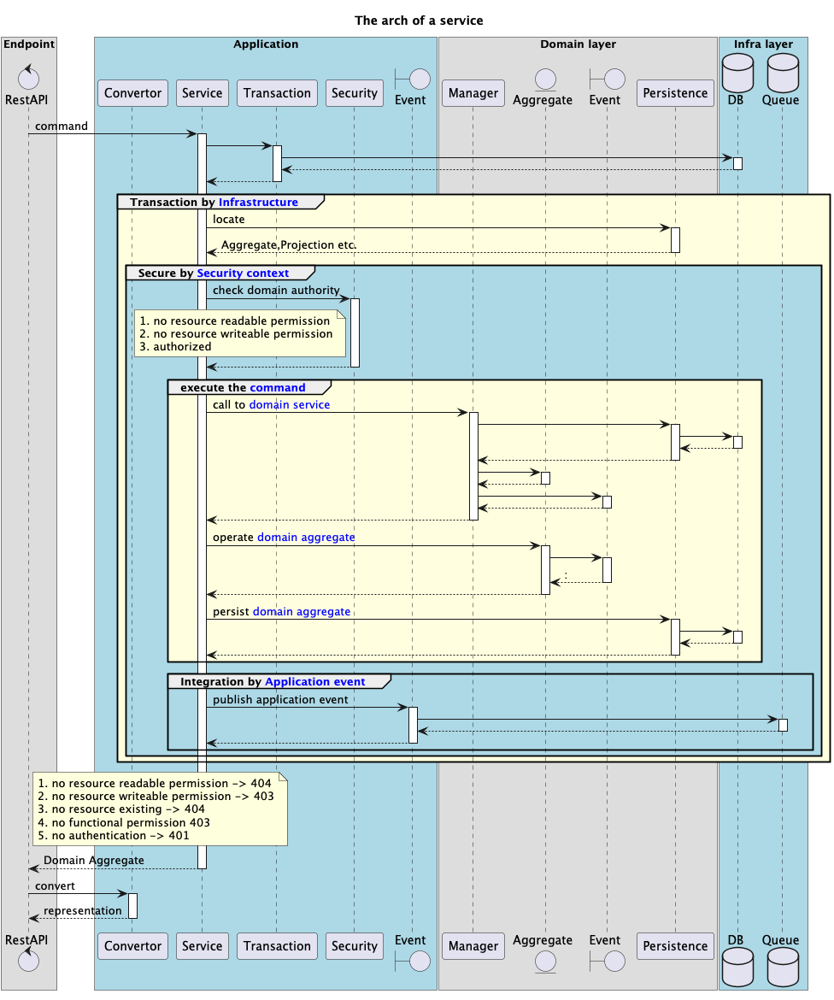

# 🛠️ Eleven
**低成本可落地的领域驱动设计（DDD）技术方案脚手架**

## 📖 项目介绍
Eleven 是遵循DDD理念的工程化脚手架，通过标准化架构助力快速构建可维护的企业级应用。核心设计原则：

### 🌟 分层架构规范
1. **四层清晰分离**
    - **UI层** 🖥️：处理用户交互，校验输入、转换DTO，仅调用应用层接口（无业务逻辑）。
    - **应用层** 🧩：协调流程、定义粗粒度服务，处理事务/权限，依赖领域层抽象接口。
    - **领域层** 🏰：封装业务核心（实体/聚合/事件），独立于技术实现，通过抽象接口交互。
    - **基础设施层** ⚙️：实现上层抽象（如仓储），提供技术支撑（数据库/消息队列），支持透明替换。

2. **依赖严格控制**
    - 上层依赖下层抽象（如应用层用`UserRepository`接口而非具体实现），禁止反向依赖（技术层不依赖业务层）。

3. **层间协作规范**
    - 接口使用领域通用语言（如`OrderId`），通过DTO解耦数据格式，禁止跨层直接调用（如UI层不直连领域层）。

4. **可演进设计**
    - 各层独立演进（换框架/数据库不影响其他层），业务规则与技术细节分离（核心逻辑在领域层，技术实现下沉）。

## 👥 适用群体

Eleven 脚手架精准适配多类研发场景，核心适用群体包括：

### 1. **复杂业务开发团队** 🌐
- 业务逻辑复杂（金融、供应链、ERP等），需通过DDD理清领域边界、沉淀规则，避免逻辑耦合。

### 2. **技术转型团队** ⚙️
- 从传统架构转向DDD，缺乏落地经验，通过标准化模板降低转型门槛，统一团队技术规范。

### 3. **多角色协作组织** 👩💻
- 架构师/技术经理：获得可复用架构模板，聚焦领域建模；
- 开发团队：按约定结构快速编码，减少协作成本。

### 4. **长期迭代项目** 🛠️
- 中大型项目需支持技术栈演进（如替换数据库），通过分层隔离确保核心领域稳定。

### 5. **企业级应用团队** 🏭
- 制造业、政务等复杂业务场景，依赖DDD的领域建模能力提升业务表达力。

### 6. **DDD落地迷茫者** 📖→💻
- 熟悉DDD理论但缺乏实践切入点，通过可复用架构模板、代码示例（聚合设计/分层实现），解决“知道概念却不会编码”的痛点。


Eleven 为不同阶段的团队和个人提供DDD落地支撑，从工程化模板到实践示例，助力实现业务与技术的深度对齐。

## 🧱 分层设计细则
### 包结构规范（以Java为例）
```plaintext
- xxxService         # 应用层服务（Bean级别，@Service）
  - xxxManager       # 领域服务（Bean级别，封装跨聚合业务逻辑，非DDD标准领域层，属应用层下沉）
    - xxxSupport     # 业务公共方法类（Bean级别，跨模块通用逻辑）
      - xxxEr/Or     # 业务工具类（无层级依赖，业务专属工具）
        - xxxUtil    # 通用静态工具类（与业务无关，如字符串处理）
        - xxxHelper  # 业务相关静态工具类（如订单号生成）
        - xxxContext # 框架相关工具类（如Spring上下文工具）
```



## 🔗 聚合设计核心原则
### 🌟 领域对象建模规则
#### 🗄️ 实体（Entity）
- 拥有唯一标识符（ID），通过业务操作显式管理生命周期，避免贫血模型。
- 聚合内ID局部唯一，由聚合根统一管理；禁止直接引用其他聚合实体，通过聚合根ID关联。

#### 🔑 聚合根（Aggregate Root）
- 聚合的**唯一访问入口**，外部仅能通过ID操作聚合内对象。
- 持有全局唯一ID，控制聚合内实体生命周期，确保业务规则在聚合边界内校验。
- 设计遵循“最小化原则”，避免包含无关实体，外部引用仅通过ID关联。

#### 📊 值对象（Value Object）
- 无唯一标识，通过属性值定义身份，创建后不可变（修改需创建新实例）。
- 作为数据载体存在，通过属性值比较相等性（而非引用地址）。

#### ⚙️ 领域服务（Domain Service）
- 封装跨实体/聚合的复杂业务逻辑，不依赖技术细节（如事务、UI）。
- 依赖的技术能力通过抽象接口注入（如仓储接口），保持业务纯粹性。

### 🚀 技术实现规范
#### 领域模型必选要素
- 包含实体、聚合根、仓储接口、领域事件，以及聚合根的读写操作能力。
- 业务规则集中在领域层，技术实现（如JPA）下沉至基础设施层。

#### 技术选型策略
- **持久化**：使用JPA标记实体类（当前团队技术栈适配，暂不考虑存储技术解耦）。
- **读写分离**：基于CQRS实现，严格区分读操作（查询）与写操作（命令），保证单一职责。
- **领域服务命名**：以`Manager`后缀命名（如`OrderManager`），与应用层`Service`区分。
- **领域事件管理**：通过领域服务代理事件发布，由基础设施层实现事件总线。

## 🚪 接口设计规范
### 📡 状态码约定
采用HTTP标准状态码，统一由`RestApiAdvice`处理器处理：
| 分类       | 状态码范围 | 说明                     |
|------------|------------|--------------------------|
| **成功**   | 2xx        | 200 OK（统一成功响应）   |
| **客户端错误** | 4xx        | 404（资源不存在）、403（权限不足）、422（参数校验失败） |
| **服务器错误** | 5xx        | 500 INTERNAL_SERVER_ERROR（服务端异常） |

### 🧭 REST API 设计原则
| 操作类型   | 方法  | 路径       | 响应规范                          |
|------------|-------|------------|-----------------------------------|
| 创建       | POST  | `/XXX`     | 200 OK（返回创建的资源或失败原因）|
| 读取       | GET   | `/XXX`     | 200 OK（返回资源或失败原因）      |
| 全量更新   | PUT   | `/XXX`     | 200 OK（幂等操作，无响应体）      |
| 局部更新   | PATCH | `/XXX`     | 200 OK（返回更新结果或失败原因）  |
| 删除       | DELETE| `/XXX`     | 200 OK（无响应体，失败时返回原因）|

### 🔄 微服务交互规范
#### 内部API（`@AsInnerApi`）
- 前缀：`/inner`
- 特性：不注册到网关，权限自管理，支持非REST风格（面向命令）。

#### 客户端API（`@AsRestApi`）
- 前缀：`/rest`
- 特性：注册到网关，统一权限校验，遵循REST规范。

## ❓ 常见问题解答
### Q：如何理解需求分类（实时/异步、读写操作、一致性）？
- **实时/写操作/强一致** 🚀：单体应用中通过同步调用领域服务，在同一事务中保证数据一致性（如订单支付即时生效）。
- **异步/写操作/最终一致** ⏳：通过消息队列（MQ）异步处理，适用于实时性要求低、高吞吐量场景（如异步日志记录）。
- **异步/只读** 🔄：纯通知类场景，异步处理提升性能并解耦服务（如邮件通知）。

### Q：为何领域层不分`/repository`/`/entity`包？
> 领域层的复杂度源于业务逻辑而非技术分层。过度拆分包结构可能导致“模式滥用”，核心是通过聚合、领域服务等DDD工具管理复杂性，而非机械套用目录结构。

### Q：领域层拦截器会污染核心逻辑吗？
> 核心逻辑的纯净性取决于设计决策，而非技术手段。合理使用AOP（如事务管理）下沉技术细节，确保领域对象专注业务规则，避免混杂日志、权限等横切逻辑。

### Q：为何领域服务不命名为`DomainService`？
> DDD的核心是“统一语言”与“解耦”，而非僵化命名。`Manager`等命名更贴合团队通用语言，关键是通过接口清晰区分领域服务与应用服务的职责边界。

### Q：为何强调核心技术文档而非海量文档？
> 遵循敏捷原则，核心设计文档（如领域模型、分层规则）需精确推导代码实现，而流水账文档易过时且难维护，聚焦“必要文档”而非形式主义。

### Q：DDD仅适用于互联网领域吗？
> 恰恰相反，DDD的价值在复杂业务场景（如金融、制造业）更为显著。互联网应用常因过度简化忽略领域建模，导致后期维护成本激增。

## 🐳 Docker 配置
项目提供容器化部署支持，核心配置位于：
`src/docker/eleven/docker-compose.yml`
包含Redis、Upms、Demo等服务的容器编排定义，支持一键启动。

## 💡 使用建议
1. **框架扩展**：在`eleven-framework`模块中封装通用技术能力（安全认证、日志处理）。
2. **业务实现**：按DDD规范在`eleven-service`模块中构建领域模型，优先在应用服务下创建`core`（业务无关公共代码）与`common`（业务相关公共代码）包。
3. **持续沉淀**：定期将`core`包代码提炼至`eleven-framework`，`common`包代码沉淀为业务组件，避免重复造轮。
4. **代码评审**：严格按照分层规则与领域模型设计原则进行评审，确保架构不腐化。


通过Eleven脚手架，团队可快速落地DDD最佳实践，聚焦业务建模而非架构搭建，在复杂业务场景中保持系统的可演进性与可维护性。🚀
